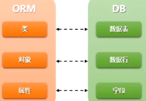
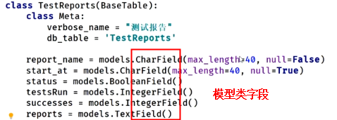

## ORM模型

O(object): 类和对象  
R(Relation): 关系，关系数据库中的表格  
M(Mapping): 映射  
  
对象在数据库关系中的映射.  

### ORM框架的功能
1. 建立模型类和表之间的对应关系，允许我们通过对象的方式来操作数据库  
2. 根据设计的模型类,生成数据库中的表格  
3. 通过方便的配置就可以进行数据库的切换  

### 数据库中的类型字段
#### mysql常用的数据类型  
整数：int，bit  
小数：decimal(表示浮点数，如decimal(5,2)表示共存5位数，小数占2位  
字符串：varchar(可变长度)，char(不可变长度)  
日期时间：date，time，datetime  
枚举类型: enum  
#### ORM模型中的对应的字段（以django的ORM模型中选取的几个字段）  
BooleanField ：布尔类型    
CharField(max_length:最大长度)：字符串   
IntegerField ：整数   

### 模型类案例

