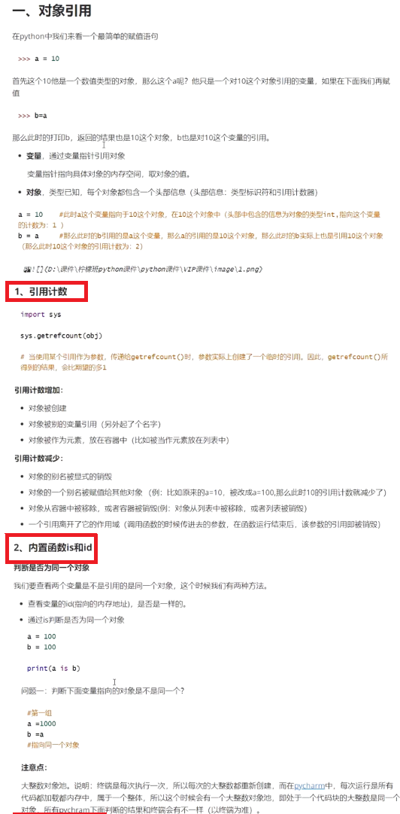
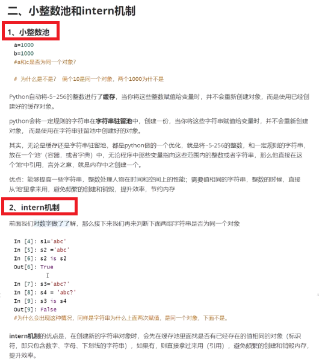
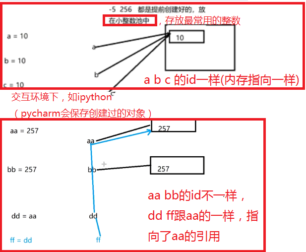
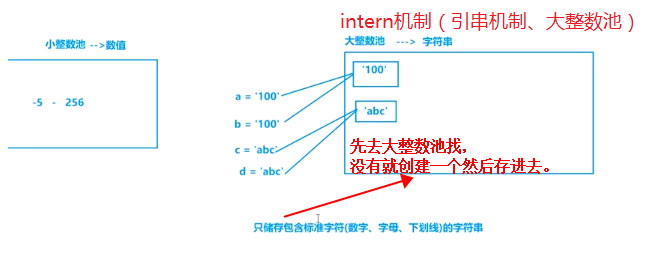
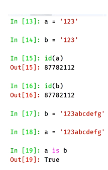
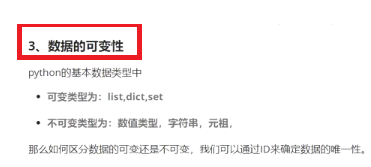
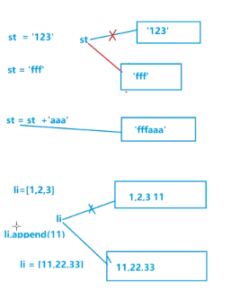

## 1、对象引用和引用计数

## 2.1小整数池
  

## 2.2大整数池、intern机制、引串机制  
  

## 3.数据可变性和不可变性  
（指修改数据时，引用指向的内存地址 [内存中放了数据对象] 是不是可变的，不变就是不可变数据）  
如list.append是可变数据类型，不改变内存地址 [直接改了同一块内存中的数据]，可以增删改查数据。    
  

