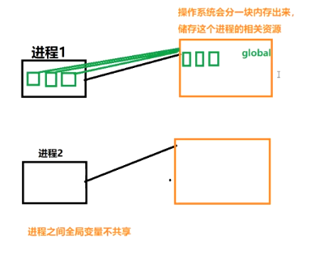

一台计算机的cpu是8核, 实际程序是并发+并行的.  
并行: 小于等于8个任务,至少每人一个cpu.  
并发: 任务大于8,存在并发的情况(cpu切换足够块,)  

# 1、进程介绍
## 什么是进程
### 程序：
例如xxx.py这是程序，是一个静态的  
### 进程：
一个程序运行起来，代码+用到的资源称之为进程，它是操作系统分配资源的基本单位
不仅可以通过线程来完成多任务，进程也是可以的
### 进程的状态
工作中，任务数往往大于CPU的核数，即一定有一些任务在等待CPU执行，因此有了不同的状态  
就绪状态：运行的条件都已经满足了，正在等待CPU执行  
执行状态：CPU正在执行其功能  
等待状态：等待某些条件满足，例如一个程序sleep了，此时就处于等待状态  

# 2、进程、线程对比
## 功能
进程，能够完成多任务，比如在一台电脑上能够同时运行多个软件
线程，能够完成多任务，比如一个QQ中的多个聊天窗口
## 定义不同
进程是系统进行资源分配和调度的一个独立单位
线程是进程的一个实体，是CPU调度和分派的基本单位，它是比进程更小的能独立运行的基本单位，线程自己基本上不能拥有系统资源，只拥有一点在运行中必不可少的资源，但是它可与同属于一个进程的其他线程共享进程所拥有的全部资源
## 区别
一个程序至少拥有一个进程，一个进程至少拥有一个线程
线程的划分适度小于进程(资源比进程小)，使用多进程成功的并发性高
进程在执行过程中拥有独立的内存单元，而多个线程共享内存，从而极大的提高了程序的运行效率
线程不能独立执行，必须依存在进程中
可以将进程理解为一个工厂的流水线，而其中的线程就是这个流水线上的工人
## 优缺点
线程个进程在使用上各有优缺点：线程执行开销小，但不利于资源的管理和保护，而进程正相反

